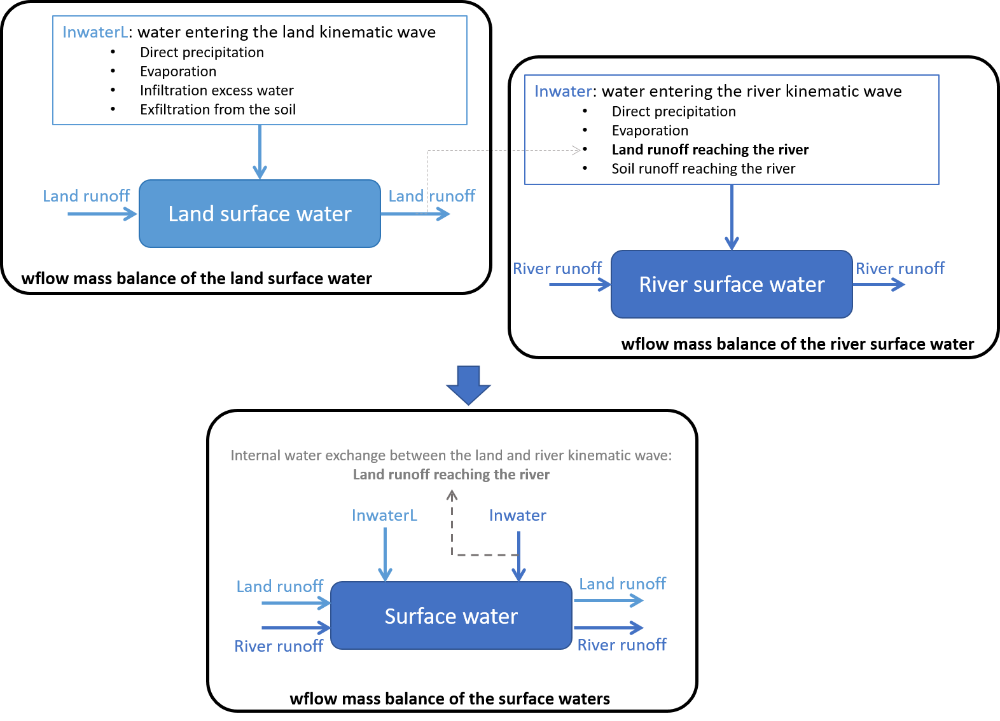

.. _coupling_wflow:

Coupling with Wflow
===================

Concepts of the Wflow - Delwaq coupling
---------------------------------------
Water quality and emission, fate and transport of pollutants through the landscape is very much linked to the water movements. In most cases, pollutants are emitted on land and 
either leach into the soil or are picked up by water during rain events and transported towards and into the rivers. In order to model water quality is it therefore essential to first understand and assess the hydrology of the catchment / region of interests.

A full hydrology - water quality modelling suite is in general separated in three parts:

-  the hydrological model, *wflow_sbm*, that predicts water movements through the catchments.
-  an emission model, *D-Emission* (also referred to as EM in hydroMT), that predicts the quantity (fluxes) of substances being released from sources of pollutants to the surface waters (mass/time).
-  a fate and transport model, *D-Water Quality* (also referred to as WQ in hydroMT), that predicts the fate and transport of substances in the surface waters (concentrations in mass / volume).

.. image:: ../img/wflow-Delwaq.jpg

For the purpose of modelling catchment water quality, the wflow_sbm model has been linked to EM and WQ (both based on Delwaq, Deltares water quality software) using a "coupling" function integrated in the 
HydroMT-Delwaq plugin.

The wflow-Delwaq coupling function in hydroMT:

-  translates wflow schematization to Delwaq schematization;
-  prepares static inputs needed for water quality modelling (emission sources, locators...);
-  prepares dynamic inputs needed for water quality modelling (different water fluxes and volumes);
-  supports the modelling of different types of pollutants.

A full hydrology - water quality modelling suite is setup and run using the following steps:

A)  Hydrological modelling with wflow

-  Run wflow in order to prepare the hydrological fluxes required by EM and WQ.

B)  Emissions modelling with D-Emissions

-  Setup the EM model from wflow and emission data using hydroMT
-  Edit the EM run info and run D-Emission (EM-Plugin)

C)  Fate and transport modelling with D-Water Quality

-  Setup the WQ model from wflow and emission data using hydroMT
-  Link EM results to WQ
-  Edit the WQ run info and run D-Water Quality (WQ-Plugin)

Hydrological forcing from Wflow
-------------------------------

In order to determine how and where substances are emitted and how they move through the landscape via the surface water, water quality modelling requires certain 
hydrological information.

For an EM type of model (emission of substances in the surface waters), the required information is:

-  **precipitation**;
-  the amount of the precipitation that **infiltrates** into the soil from unpaved areas;
-  the amount of the precipitation that goes directly **to surface runoff from paved areas**;
-  the amount of the precipitation that goes directly **to surface runoff from unpaved areas**.

For a WQ type of model (fate and transport of substances in the surface waters), the required information is:

-  **Surface runoff**
-  **Surface water volumes**
-  **Total water entering the surface waters** (e.g. precipitation, exfiltration from the soil, evaporation...) in order to close the surface water mass balance.

Wflow separates and routes water for three different components, the surface waters on the land, the river surface water and the water in the soil. Delwaq uses only the one surface water components 
and therefore the river and land surface waters from wflow are saved together for Delwaq. The corresponding water balances for the river and land surface waters in wflow are shown in the Figure below. 
In order to prepare hydrological fluxes for Delwaq from wflow, Wflow should be run and the required fluxes saved (same order as above):

-  vertical.precipitation (precipitation input)
-  vertical.actinfilt (infiltration in the soil)
-  vertical.excesswaterpath (infiltration excess runoff on paved areas)
-  vertical.excesswatersoil (infiltration excess runoff on unpaved areas)
-  lateral.river.q_av and lateral.land.q_av (runoff in the river and land kinematic wave)
-  lateral.river.h_av and lateral.land.h_av (water level in the river and water level on the land)
-  lateral.river.qlat, lateral.land.qlat and lateral.land.to_river (qlat river/land is the sum of all fluxes reaching the kinematic wave of the river/land surface water. As 
   qlat also contains an internal flux between the land and river water, the part of land runoff that reaches the river lateral.land.to_river, we will need to substract 
   it to not count it twice, see Figure below).

Figure of the Wflow water balances for the land surface water (top left), river surface water (top right) and the total surface water (bottom).
