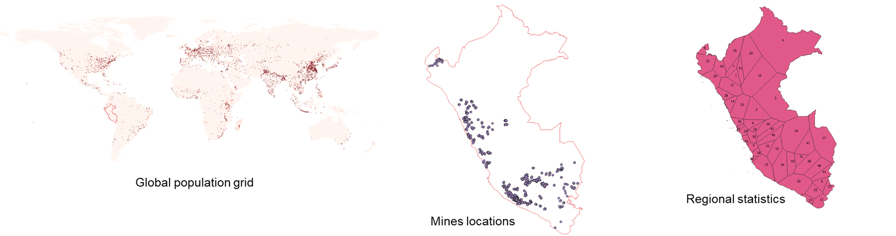
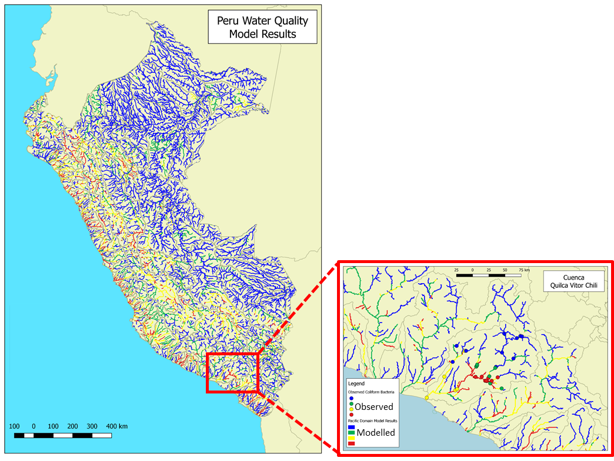
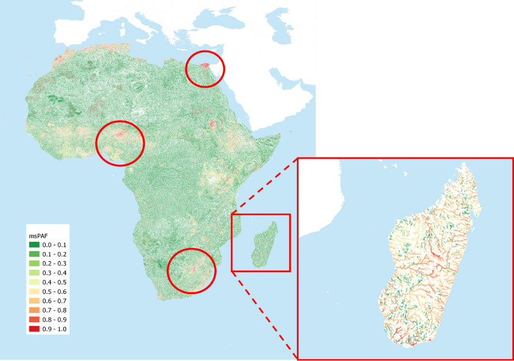

.. _user_stories:

User's stories
==============

.. _use_case_waq_peru:

Water quality diagnostic in Peru
--------------------------------
Deltares BlueEarth new approach on model setup, **from global to local**, was applied recently
in Peru for a nation-wide water quality diagnostic project. The Wflow hydrologic and DELWAQ water
quality models were first prepared from global data and refined later using collected local data.
For the water quality model alone, more than forty emission input data were prepared using a combination
of global and local sources in various format using the HydroMT tool. These include global population
and cattle grids, local mines and industry locations, regional statistics for GDP or treatment infrastructures etc.
The wflow model was forced using local meteorological grids (PISCO).

With this combination of local and global dataset, water quality hotspots for different substances and pressures
could be assessed and compared to field observations (BOD, E. Coli, Nutrients, Metals from mining industry and
chemicals).

.. _use_case_waq_global:

Global water quality modelling
------------------------------
Recently, Deltares has become involved in the United Nations Environment Program, which is organized as
a consortium of relevant organizations to develop a World Water Quality Assessment (WWQA). Deltares is
participating in this WWQA as an opportunity to contribute to mitigating the world-wide water quality crisis,
as well as a good way to promote our knowledge, skills, and software. Our role consists of providing a global
assessment of the concentrations of contaminants, as well as the impact these substances have on ecology and/or
human health. Applying the models at this scale (whole of Africa) on a 1x1 km2 resolution also provided
us with valuable insight in the capabilities and challenges of setting up models at this scale.

