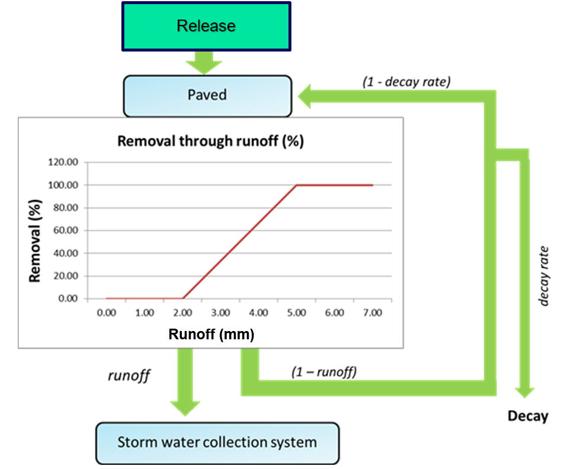
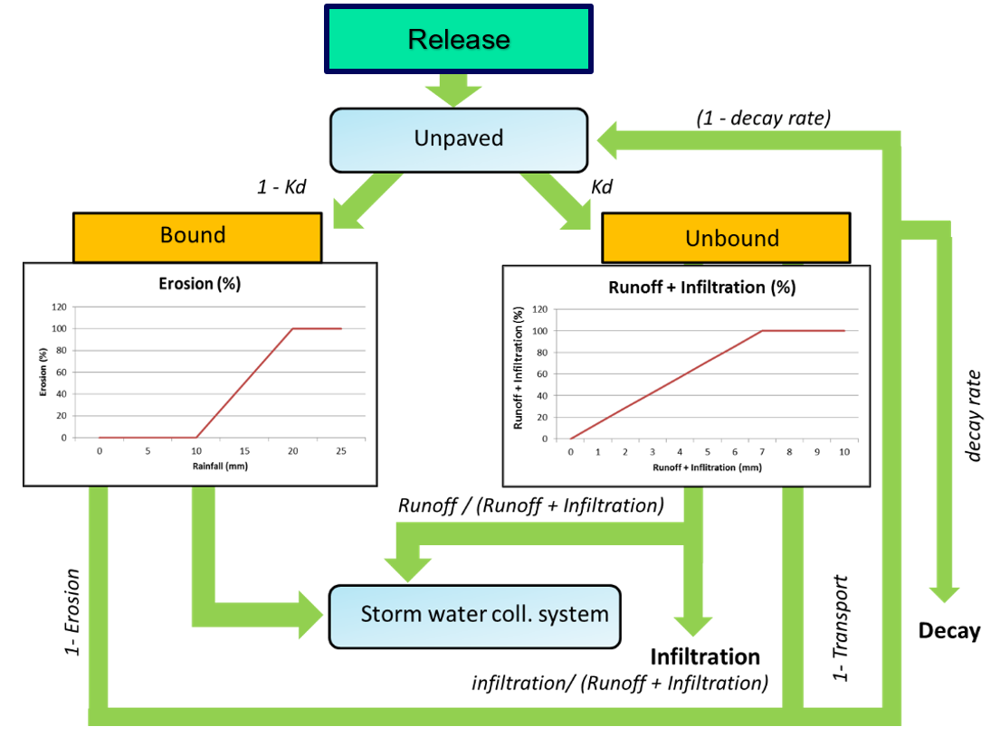

.. _EM_functional_description:

===============================
Detailed functional description
===============================

.. _EM_GSS:

Generic Single Substance Emission Model (EM_GSS)
================================================

Introduction
------------

This process quantifies releases to various compartments and routes them to the final recipients: surface waters and soils. It is applied for a single substance.

Releases are defined for:

•	Atmospheric deposition: dry deposition as mass/time/surface area, wet deposition as mass/volume in precipitation;
•	A variable number of “type A” sources;
•	A variable number of “type B” sources.

The quantification of the releases of polutants associated to the various sources proceeds by the emission factor method. A variable collection of sources can be considered. Releases (:math:`L`) of a pollutant “p” for a certain socio-economic activity “a” are calculated by multiplying an activity rate (:math:`AR_a`) by an emission factor for this activity and a certain pollutant (:math:`EF_{p,a}`):

.. math::
    :label: Eq_release_polutant

    L_{p,a} = AR_a * EF_{p,a}

Releases are distributed in space according to two alternative methods:

A.	The activity rate is known for a larger geographic area (region, country). The releases are first calculated at this aggregated level and then distributed in space using an auxiliary spatial variable called a “locator”.
B.	The activity rate is already a spatially distributed variable and can be directly used to calculate spatially variable releases.

The quantified releases are allocated to various initial receptors and routed towards the final receiving compartments: the soil system or the surface waters. Initial receptors can be: (1) the surface waters (directly), (2) the soil system (directly), (3) impermeable surfaces, (4) permeable surfaces, (5) the sewage collection system (combined or separated) and (6) the separate rainwater collection system.

The emissions related to stormwater and wastewater are simulated as follows:

•	The allocation of the wastewater releases from households to initial receptors should take into account the share of unconnected households and the share of households using septic tanks or other “individual or appropriate systems” (IAS, as defined under the Urban Wastewater Treatment Directive).
•	The substances washed off from impermeable areas find their way to a separate rainwater collection system, a combined collection system for stormwater and wastewater or to surface waters and soils in places where there is no collection system.
•	Separate collection systems discharge to surface waters, while a retention term can be defined that is partly allocated to soils (re-use or distribution of sludge).
•	Combined collection systems discharge via a WWTP, where the treatment level can be variable.
•	Combined collection systems feature overflow events (CSOs), during which the treatment is bypassed; CSOs are a fixed fraction or occur if a daily rainfall threshold is exceeded.

Implementation
--------------

The EM is currently configured for 6 compartments.

.. _EM_compartments:

.. list-table::
   :widths: 5, 25
   :header-rows: 1

   * - Abbreviation
     - Description
   * - ``Sew`` 
     - Sewer system that receives wastewater and (optionally) stormwater
   * - ``Pav``
     - Paved or impermeable surfaces
   * - ``Unp``
     - Unpaved or permeable surfaces
   * - ``Stw``
     - Sewer system that receives only stormwater
   * - ``Sfw``
     - Final recipient surface water, all matter that ends up here is “emissions to surface waters”
   * - ``Soi``
     - Final recipient soil system, all matter that ends up here is “emissions to soils” 

In the EM software, these compartments are mathematically represented by substances. The mass of the simulated substances is expressed in grams. Transports from one compartment to another (in g s-1) are mathematically represented by “process fluxes” (transformations of one substance into another substance). This comes back in the mass balance output.

As the mathematical concept of a “substance” is used to represent compartments, EM has been set up to run for one “true” substance at a time.

Formulation
-----------

Releases
^^^^^^^^

Releases of substances are quantified per time step. 
Releases from atmospheric deposition are automatically allocated to the proper receiving compartment (paved surfaces, unpaved surfaces and surface waters) depending on the local conditions that follow from the supportive hydrology model. 
Releases from other sources need to be allocated to the proper receiving compartment by the user. 
Optionally, a part of the releases can be **preliminary** allocated to wastewater. 
The subsequent allocation of the wastewater to receiving compartments can then be arranged by a supportive process :ref:`GenWWman <GenWWman>`.

Paved surfaces
^^^^^^^^^^^^^^

The figure below shows a schematic overview of the fate of releases to paved areas. 
Substances reaching paved areas undergo a decay process and can be washed off. 
The fraction that is not removed by runoff or decay remains in the paved emission pool. 
The intensity of runoff is regulated by the rainfall intensity. 
Wash-off starts at a threshold of 2 mm runoff and the removed fraction linearly increases to 100% at a runoff intensity of 5 mm. 
This relation is fixed in the model code.

*Schematic overview of the pathway that releases follow when distributed to the paved areas. 
The fate of the release is either runoff to storm water or decay and thereby removal from the model.*

In formulas:

.. math::
    :label: Eq_Paved1

    f_{runoff} = 
    max \left( min \left( \frac{RO - 2}{5 - 2},1  \right),0 \right)

.. math::
    :label: Eq_Paved2

    F_{loss} =
    k_{paved} M

.. math::
    :label: Eq_Paved3

    F_{runoff} =
    \left( \frac{M}{\Delta t} + L - F_{loss} \right) * f_{runoff}

where

======================    =========================================
:math:`f_{runoff}`        fraction washed off by surface runoff (-)
:math:`RO`                actual surface runoff intensity (mm/d)
:math:`F_{loss}`          flux lost by decay (g/d)
:math:`k_{paved}`         decay rate (1/d)
:math:`M`                 mass available on paved surfaces (g)
:math:`F_{runoff}`        flux washed off by surface runoff (g/d)
:math:`L`                 releases to paved surfaces (g/d)
:math:`\Delta t`          time step in calculation (d)
======================    =========================================

The washed off substances are distributed over different compartments:

•	A fraction *FrSewered* is distributed over the *Sew* and *Stw* compartments according to the parameter *fComSew*.
•	Out of the remainder, a fraction *fOpenWater* is allocated to *Sfw* and the rest to *Soi*.

Unpaved surfaces
^^^^^^^^^^^^^^^^

The figure below presents a schematic overview of the simulated pathways for unpaved areas. 
The unpaved pool is undergoing burial and decay. 
Both processes remove substances from the simulation. 
Depending on the hydrological conditions, a fraction of the pool can be washed off, infiltrate or erode. 
The fraction of the emission that is not removed by any of these processes remains in the unpaved pool.

The pool is split into fractions bound and unbound to soil particles (parameter :math:`Kd_{unpaved}`). 
The bound fraction can erode, the unbound fraction can infiltrate and be washed off. 
Erosion depends on the rainfall intensity: 10 - 20 mm rainfall is equivalent to 0 - 100% erosion (see figure below). 
Wash-off and infiltration also depend on rainfall intensity: 0 - 7 mm of combined runoff and infiltration lead to 0 - 100% of mobilization, 
distributed over wash-off and infiltration in accordance with the hydrological fluxes. 

*Schematic overview of the pathways in unpaved areas. 
The releases are first divided over the bound and unbound fractions. 
The fate of the unbound fraction is either runoff to the storm water collection system (runoff) or infiltration to the soil. 
The fate of the bound fraction is erosion. 
Both fractions will experience burial and decay and thereby removal from the model.*

In formulas:

.. math::
    :label: Eq_Unpaved1

    f_{erosion} = 
    max \left( min \left( \frac{RA - 10}{20 - 10},1  \right),0 \right)

.. math::
    :label: Eq_Unpaved2

    f_{mob} = 
    max \left( min \left( \frac{RO + INF}{7},1  \right),0 \right)

.. math::
    :label: Eq_Unpaved3

    f_{runoff} = 
    max \left( min \left( \frac{RO}{RO + INF},1  \right),0 \right)

.. math::
    :label: Eq_Unpaved4

    f_{infilt} = 
    max \left( min \left( \frac{INF}{RO + INF},1  \right),0 \right)

.. math::
    :label: Eq_Unpaved5

    F_{loss} = 
    \left( k_{unpaved} + b \right) M

.. math::
    :label: Eq_Unpaved6

    F_{part} = 
    Kd_{unpaved} * \left( \frac{M}{\Delta t} + L - F_{loss} \right)

.. math::
    :label: Eq_Unpaved7

    F_{dis} = 
    \left(1 - Kd_{unpaved} \right) * \left( \frac{M}{\Delta t} + L - F_{loss} \right)

.. math::
    :label: Eq_Unpaved8

    F_{erosion} = F_{part} * f_{erosion}

.. math::
    :label: Eq_Unpaved9

    F_{infilt} = F_{dis} * f_{mob} * f_{infilt}

.. math::
    :label: Eq_Unpaved10

    F_{runoff} = F_{dis} * f_{mob} * f_{runoff}

where

======================    ================================================
:math:`f_{erosion}`       fraction eroded by surface runoff (-)
:math:`f_{mob}`        	  fraction mobilised by runoff or infiltration (-)
:math:`f_{runoff}`        fraction mobilised by surface runoff (-)
:math:`f_{infilt}`        fraction mobilised by infiltration (-)
:math:`RO`                actual surface runoff intensity (mm/d)
:math:`RA`                actual rainfall intensity (mm/d)
:math:`INF`        	      actual infiltration intensity (mm/d)
:math:`F_{loss}`          flux lost by decay (g/d)
:math:`k_{unpaved}`       decay rate (1/d)
:math:`b`                 burial rate (1/d)
:math:`Kd_{unpaved}`      partition fraction (-)
:math:`M`                 mass available on unpaved surfaces (g)
:math:`F_{loss}`          flux lost by decay (g/d)
:math:`L`                 releases to unpaved surfaces (g/d)
:math:`\Delta t`          time step in calculation (d)
:math:`F_{part}`          particulate flux available for transport (-)
:math:`F_{dis}`        	  dissolved flux available for transport (-)
:math:`F_{erosion}`       erosion flux by surface runoff (-)
:math:`F_{runoff}`        runoff flux (-)
:math:`F_{infilt}`        infiltration flux (-)
======================    ================================================

The washed off and eroded fractions are routed to the *Sfw* compartment. 
The infiltrating fraction is routed to the *Soi* compartment. 

Combined sewer systems
^^^^^^^^^^^^^^^^^^^^^^

A flux from the Sew to surface water is defined that corresponds to leakages and combined sewer overflows (CSO's). 
This is controlled by the parameter *SewLeakage*. 
If this parameter is a positive number, it represents a constant leakage fraction. 
If this parameter is negative, it represents a precipitation threshold. 
If the threshold is exceeded, the inflow to the Sew compartment is directly routed to *Sfw*.

The parameters *LocWWTP* and *RecWWTP* allow a man-induced horizontal displacement of the collected water in the *Sew* compartment. 
This is only relevant in small scale applications, e.g. in cities.

The substances remaining in *Sew* undergo a treatment. 
The fate of the substances in the influent is fixed by the parameters specifying the fractions that end up in effluent (*Eff_WWTP*) and in sludge (*Sld_WWTP*) respectively. 
These two parameters implicitly determine the removal by wastewater treatment (*1 - Eff_WWTP-Sld_WWTP*).

Separated sewer systems
^^^^^^^^^^^^^^^^^^^^^^^

The parameters *LocSTW* and *RecSTW* allow a man-induced horizontal displacement of the collected water in the *Sew* and *Stw* compartments respectively. 
This is only relevant in small scale applications, e.g. in cities.

The substances remaining in *Stw* can partly be retained. 
The fate of the substances in the influent is fixed by the parameters specifying the fractions that end up in effluent (*Eff_RS*) and in sludge (*Sld_RS*) respectively. 
These two parameters implicitly determine the retention (*1 - Eff_RS-Sld_RS*).

Input
-----

.. list-table::
   :widths: 10, 25, 10, 10
   :header-rows: 1

   * - Name in model
     - Definition
     - Unit
     - Spatial function?
   * - ``fComSew``
     - fraction of combined sewers
     - (-)
     - yes
   * - ``SewLeakage``
     - sewer leakage / CSO definition
     - (-) or mm/day
     - yes
   * - ``LocWWTP``
     - whereto for mixed sewers
     - (-)
     - yes
   * - ``RecWWTP``
     - receivers of mixed sewers
     - (-)
     - yes
   * - ``LocSTW``
     - whereto for rain sewers
     - (-)
     - yes
   * - ``RecSTW``
     - receivers of rain sewers
     - (-)
     - yes
   * - ``kBurial``
     - burial rate of unpaved pool
     - (-)
     - no
   * - ``DecPav``
     - decay rate paved (substance dependent)
     - (/d)
     - no
   * - ``DecUnp``
     - decay rate unpaved  (substance dependent)
     - (/d)
     - no
   * - ``KdUnpa``
     - fraction of bound vs unbound (substance dependent)
     - (-)
     - no
   * - ``EF_DDp``
     - dry deposition rate (substance dependent)
     - (g/m2/d)
     - yes
   * - ``EF_WDp``
     - wet deposition rate (substance dependent)
     - (g/m3)
     - yes
   * - ``Eff_WWTP``
     - fraction of substance in WWTP influent that reaches the effluent (substance dependent)
     - (-)
     - yes
   * - ``Sld_WWTP``
     - fraction of substance in WWTP influent that reaches the sludge (substance dependent)
     - (-)
     - yes
   * - ``Eff_RS``
     - Fraction to effluent of rain sewers influent (substance dependent)
     - (-)
     - yes
   * - ``Sld_RS``
     - Fraction to sludge of rain sewers influent (substance dependent)
     - (-)
     - yes
   * - ``FrSewered``
     - fraction wastewater and stormwater intercepted by sewer systems
     - (-)
     - yes
   * - ``WWtoSew``
     - fraction of wastewater allocated to mixed sewers
     - (-)
     - yes
   * - ``WWtoSfw``
     - fraction of wastewater allocated to surface waters
     - (-)
     - yes
   * - ``WWtoSoi``
     - fraction of wastewater allocated to soils
     - (-)
     - yes
   * - ``EV_A01``
     - emission variable of source A01
     - ( X )
     - no
   * - ``LOC_A01``
     - locator variable of source A01
     - ( Y )
     - yes
   * - ``EF_A01``
     - emission factor of source A01 (substance dependent)
     - (kg/d/X)
     - yes
   * - ``A01toWW``
     - released fraction to wastewater of source A01
     - (-)
     - yes
   * - ``A01toSew``
     - released fraction to mixed sewers of source A01
     - (-)
     - yes
   * - ``A01toPav``
     - released fraction to paved areas of source A01
     - (-)
     - yes
   * - ``A01toUnp``
     - released fraction to unpaved areas of source A01
     - (-)
     - yes
   * - ``A01toStw``
     - released fraction to separated sewers of source A01
     - (-)
     - yes
   * - ``A01toSfw``
     - released fraction to surface waters of source A01
     - (-)
     - yes
   * - ``A01toSoi``
     - released fraction to soils of source A01
     - (-)
     - yes
   * - ``EV_B01``
     - locator/EV variable of source B01
     - ( X )
     - yes
   * - ``EF_B01``
     - emission factor of source B01 (substance dependent)
     - (kg/d/X)
     - yes
   * - ``B01toWW``
     - released fraction to wastewater of source B01
     - (-)
     - yes
   * - ``B01toSew``
     - released fraction to mixed sewers of source B01
     - (-)
     - yes
   * - ``B01toPav``
     - released fraction to paved areas of source B01
     - (-)
     - yes
   * - ``B01toUnp``
     - released fraction to unpaved areas of source B01
     - (-)
     - yes
   * - ``B01toStw``
     - released fraction to separated sewers of source B01
     - (-)
     - yes
   * - ``B01toSfw``
     - released fraction to surface waters of source B01
     - (-)
     - yes
   * - ``B01toSoi``
     - released fraction to soils of source B01
     - (-)
     - yes

.. Note::
    •	Where “Spatial function?” is indicated as “yes”, the user has the option to specify the related input as a function of space. Where this is indicated as “no”, any defined spatial variability is **neglected** (the value for the first cell will be applied model-wide).
    •	A supportive process can provide the allocation of the substances released to wastewater to the receiving compartments (*WWtoSew*, etc.) (see :ref:`GenWWman <GenWWman>`).
    •	A supportive process can provide the WWTP treatment parameters (*Eff_WWTP*, *Sld_WWTP*) as a spatially variable mix of up to three available treatment levels (see :ref:`GenWWman <GenWWman>`).
    •	Note that some parameters are substance dependent. The user should take care to define realistic values.

Output
------

The simulated emissions to surface waters (*Emis_Sfw*; g/s) and to soils (*Emis_Soi*; g/s) are available for output.

.. _GenWWman:

Waste water management supportive process (GenWWman)
====================================================

Introduction
------------

This process supports the emission modelling as discussed in :ref:`EM_GSS <EM_GSS>` by providing the allocation of the substances released to wastewater to the receiving compartments (*WWtoSew*, etc.)
and by providing the WWTP treatment parameters (*Eff_WWTP*, *Sld_WWTP*) as a spatially variable mix of up to three available treatment levels.

Implementation
--------------

The process is implemented for the compartments listed in Table :ref:`EM compartments <EM_compartments>`. 
The local treatment capacity can be specified for up to three levels of treatment, each with different properties.

Formulation
-----------

Allocation of wastewater to receiving compartments
^^^^^^^^^^^^^^^^^^^^^^^^^^^^^^^^^^^^^^^^^^^^^^^^^^
Wastewater is either collected in a sewer system (*FrSewered*), or in septic tanks (*FrSeptic*) or remains unmanaged (*1 - FrSewered - FrSeptic*).

For the fraction collected in septic tanks, a loss to surface waters (*Eff_Septic*) and to soils (*Sld_Septic*) can be defined. The remaining part is assumed transported to treatment plants by other means than sewer systems. 

From the unmanaged wastewater, a fraction *fOpenWater* is allocated to surface waters, the remainder to soils. 

Thus, the allocation of wastewater to the modelled compartments is:

.. math::
    :label: Eq_WWman1

    WWtoSew = FrSewered + FrSeptic*(1-Eff\_Septic-Sld\_Septic)

.. math::
    :label: Eq_WWman2

    WWtoSfw = FrUnManaged*fOpenWater + FrSeptic*Eff_Septic

.. math::
    :label: Eq_WWman3

    WWtoSoi = FrUnManaged*(1-fOpenWater) + FrSeptic*Sld_Septic

Fate of substances reaching WWTPs
^^^^^^^^^^^^^^^^^^^^^^^^^^^^^^^^^

The fraction of wastewater treated at three individual levels can be indicated. The remainder is assumed untreated:

.. math::
    :label: Eq_WWman4

    FrUnTreated = 1 - FrTreat1 - FrTreat2 - FrTreat3

For each of the three treatment levels, the fraction of the influent reaching the effluent and the sludge respectively is specified. 
For the untreated fraction all influent reaches the effluent.

For the complete treatment system, the fractions reaching the effluent and the sludge equal:

.. math::
    :label: Eq_WWman5

    Eff_WWTP = 
    FrUnTreated +
    FrTreat1*Eff_Treat1 +\\
    FrTreat2*Eff_Treat2 +
    FrTreat3*Eff_Treat3

.. math::
    :label: Eq_WWman6

    Sld_WWTP = 
    FrTreat1*Sld_Treat1 +
    FrTreat2*Sld_Treat2 +\\
    FrTreat3*Sld_Treat3

In a final step, the fraction reaching sludge is corrected for “removal” of sludge by incineration and isolation. 
The remaining part is routed to soils in the main emission modelling process.

.. math::
    :label: Eq_WWman7

    Sld_WWTP = Sld_WWTP*(1-fSldgRem)

Input
-----

.. list-table::
   :widths: 10, 25, 5, 10
   :header-rows: 1

   * - Name in model
     - Definition
     - Unit
     - Spatial function?
   * - ``FrSewered``
     - fraction wastewater and stormwater intercepted by sewer systems
     - (-)
     - yes
   * - ``FrSeptic``
     - fraction wastewater to septic tanks
     - (-)
     - yes
   * - ``FrTreat1``
     - fraction wastewater primary treated
     - (-)
     - yes
   * - ``FrTreat2``
     - fraction wastewater secondary treated
     - (-)
     - yes
   * - ``FrTreat3``
     - fraction wastewater tertiary treated
     - (-)
     - yes
   * - ``Eff_Septic``
     - fraction directly to surface waters for septic tanks
     - (-)
     - yes
   * - ``Eff_Treat1``
     - fraction to effluent for primary treatment
     - (-)
     - yes
   * - ``Eff_Treat2``
     - fraction to effluent for secondary treatment
     - (-)
     - yes
   * - ``Eff_Treat3``
     - fraction to effluent for tertiary treatment
     - (-)
     - yes
   * - ``Sld_Septic``
     - fraction directly to soils for septic tanks
     - (-)
     - yes
   * - ``Sld_Treat1``
     - fraction to sludge for primary treatment
     - (-)
     - yes
   * - ``Sld_Treat2``
     - fraction to sludge for secondary treatment
     - (-)
     - yes
   * - ``Sld_Treat3``
     - fraction to sludge for tertiary treatment
     - (-)
     - yes
   * - ``FrSldgRem``
     - fraction of sludge removed (not reused)
     - (-)
     - yes

.. Note::
    •	Where “Spatial function?” is indicated as “yes”, the user has the option to specify the related input as a function of space. Where this is indicated as “no”, any defined spatial variability is **neglected** (the value for the first cell will be applied model-wide).
    •	Note that some parameters are substance dependent. The user should take care to define realistic values.

Output
------

The supportive process produces the below output, that feeds directly into the main emission modelling process.

.. list-table::
   :widths: 5, 25, 5
   :header-rows: 1

   * - Name in model
     - Definition
     - Unit
   * - ``Eff_WWTP`` 
     - fraction of substance in WWTP influent that reaches the effluent (substance dependent)
     - (-)
   * - ``Sld_WWTP`` 
     - fraction of substance in WWTP influent that reaches the sludge (substance dependent)
     - (-)
   * - ``WWtoSew`` 
     - fraction of wastewater allocated to mixed sewers
     - (-)
   * - ``WWtoSfw`` 
     - fraction of wastewater allocated to surface waters
     - (-)
   * - ``WWtoSoi`` 
     - fraction of wastewater allocated to soils
     - (-)